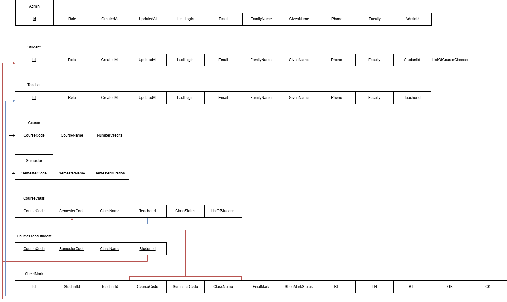
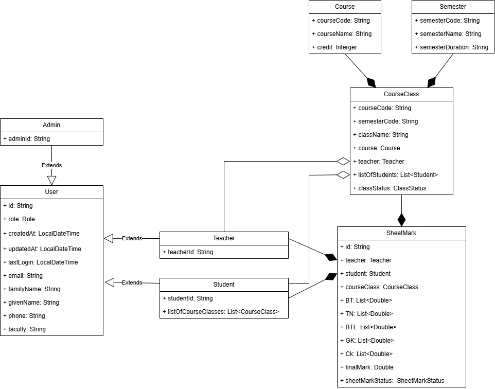

<!-- PROJECT LOGO -->
 

  

  <h3 align="center">HCMUT Grade Portal Service Server</h3>

  

    Dự án hướng đến mục tiêu xây dựng một trang web cung cấp dịch vụ quản lý điểm số tiện lợi nhanh chóng dành cho sinh viên và giảng viên trong nhà trường.
     
    <a href="../../README.md"><strong>Tổng quan dự án</strong></a>
    •
    <a href="../../reports/report.md"><strong>Báo cáo tiến độ</strong></a>
    •
    <a href="../user-guide.md"><strong>Hướng dẫn sử dụng</strong></a>
    •
    <a href="../document.md"><strong> Tài liệu dự án</strong></a>
     
     
  

# Yêu cầu về Quản lý Dữ liệu của Hệ thống Grade Portal

Đối với các yêu cầu của hệ thống Grade Portal, không khó để nhận ra các hành động liên quan tới việc **truy xuất**, **xử lý**, và **cập nhật dữ liệu** là rất quan trọng và cần sự chính xác cao. Đây cũng chính là một trong những lý do **kiến trúc phân tầng** được chọn để hiện thực hệ thống. Các thao tác liên quan tới việc xử lý dữ liệu sẽ được tập trung tại **tầng Persistence** nhằm tạo ra sự nhất quán và tránh sự phân tán cấu trúc không rõ ràng.

Ngoài ra, dữ liệu của hệ thống sẽ được lưu trữ bằng **cơ sở dữ liệu quan hệ**, cụ thể là sử dụng **hệ quản trị cơ sở dữ liệu PostgreSQL**. Điều này có nghĩa là dữ liệu trong hệ thống sẽ được chia thành các **thực thể (Entity)** với cấu trúc các trường thuộc tính và các mối quan hệ được mô tả rõ ràng trong các **class** được khai báo với **Annotation `@Table`** trong dự án.

Để hỗ trợ và cung cấp đầy đủ dữ liệu cho các **logic nghiệp vụ** của hệ thống, dưới đây là các sơ đồ **EERD**, **Relational Mapping**, và **Class Diagram** giúp người đọc có cái nhìn chi tiết nhất về cách các thực thể được lưu trong **database** và mối quan hệ giữa các thực thể đó.

Trong phần này, nhóm đã sử dụng Draw.io để hiện thực các sơ đồ. Đường dẫn cụ thể tới sơ đồ chi tiết của hệ thống nằm [ở đây](#).

## 1. EERD Diagram

EERD Diagram cung cấp một cái nhìn tổng quan về các thực thể trong hệ thống cùng các mối quan hệ giữa chúng, giúp người phát triển dễ dàng hiểu rõ về cấu trúc dữ liệu và cách mà các thực thể tương tác với nhau.

## 2. Relational Data Model

Relational Data Model mô tả cấu trúc dữ liệu theo kiểu quan hệ, bao gồm các bảng (table) và các mối quan hệ giữa chúng. Đây là sơ đồ quan trọng giúp triển khai hệ thống cơ sở dữ liệu quan hệ và đảm bảo dữ liệu được tổ chức và lưu trữ một cách logic.

## 3. Class Diagram

Class Diagram cung cấp một cái nhìn chi tiết về các class trong hệ thống, bao gồm các thuộc tính, phương thức, và mối quan hệ giữa các class. Sơ đồ này rất quan trọng cho việc triển khai các logic nghiệp vụ và là cơ sở để phát triển các chức năng của hệ thống Grade Portal.

---
