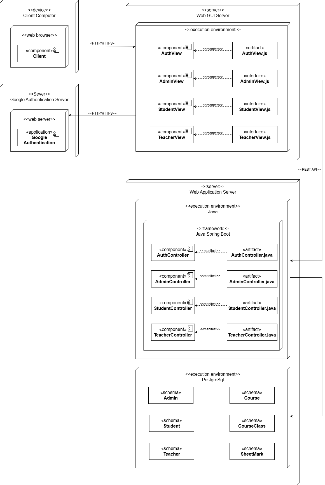

<!-- PROJECT LOGO -->
 

  

  <h3 align="center">HCMUT Grade Portal Service Server</h3>

  

    Dự án hướng đến mục tiêu xây dựng một trang web cung cấp dịch vụ quản lý điểm số tiện lợi nhanh chóng dành cho sinh viên và giảng viên trong nhà trường.
     
    <a href="../../README.md"><strong>Tổng quan dự án</strong></a>
    •
    <a href="../../reports/report.md"><strong>Báo cáo tiến độ</strong></a>
    •
    <a href="../user-guide.md"><strong>Hướng dẫn sử dụng</strong></a>
    •
    <a href="../document.md"><strong> Tài liệu dự án</strong></a>
     
     
  

# Deployment Diagram

Sau khi đọc yêu cầu của hệ thống đề ra, nhóm quyết định xây dựng bản vẽ **Deployment Diagram** cho hệ thống Grade Portal. Mặc dù hệ thống trong dự án này vẫn đang ở giai đoạn khởi đầu, với các yêu cầu kiến thức còn cơ bản, nhóm đã quyết định chia hệ thống thành **hai server riêng biệt** nhằm tối ưu hóa cho tính an ninh và khả năng mở rộng của hệ thống.

### Mô tả mô hình triển khai

- **Server 1: Web Server (Giao diện người dùng)**

  - Server này chịu trách nhiệm về **giao diện người dùng**, đảm nhận việc tiếp nhận và phản hồi các yêu cầu từ phía client.
  - Các thành phần giao diện người dùng được triển khai trên server này, giúp tối ưu hóa trải nghiệm người dùng và giảm tải cho server xử lý logic.

- **Server 2: Application Server (Logic nghiệp vụ)**
  - Server này chịu trách nhiệm xử lý toàn bộ **logic nghiệp vụ** của hệ thống.
  - Các logic nghiệp vụ được triển khai trên server này đảm bảo rằng tất cả các quy trình quan trọng như quản lý điểm, khóa học, và học sinh đều được xử lý an toàn và hiệu quả.

### Lợi ích của mô hình này

- **Bảo mật**: Việc chia hệ thống thành hai server giúp giảm rủi ro về bảo mật. Nếu có sự cố về bảo mật xảy ra ở một server, server còn lại có thể không bị ảnh hưởng.
- **Khả năng chịu tải**: Khi có nhiều người dùng truy cập vào hệ thống cùng lúc, việc chia giao diện và logic ra hai server giúp hệ thống có khả năng chịu tải tốt hơn, giảm thiểu độ trễ trong phản hồi.
- **Khả năng mở rộng**: Mô hình này cho phép hệ thống dễ dàng mở rộng khi có nhu cầu tăng cường sức mạnh xử lý hoặc bổ sung các tính năng mới. Chúng ta có thể mở rộng từng server mà không ảnh hưởng tới phần còn lại của hệ thống.

---

**Lưu ý**: Với mô hình này, hệ thống có thể dễ dàng được triển khai lên các môi trường sản xuất với khả năng mở rộng theo nhu cầu thực tế. Trong tương lai, khi yêu cầu hệ thống tăng cao, chúng ta có thể cân nhắc triển khai thêm các server chuyên dụng cho các chức năng cụ thể hoặc chuyển sang kiến trúc microservices để tăng cường hiệu suất và khả năng bảo trì.
