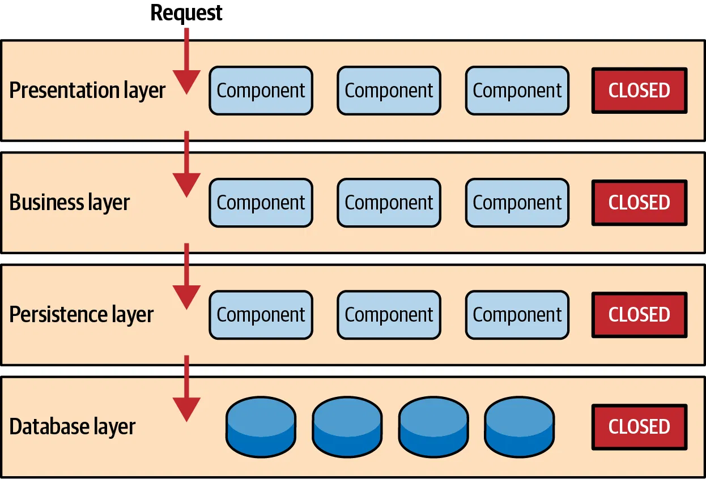

<a id="readme-top"></a>

<!-- PROJECT LOGO -->
<br />
<div align="center">
  <a href="">
    
    
  </a>

  <h3 align="center">HCMUT Grade Portal Service Server</h3>

  <p align="center">
    Dự án hướng đến mục tiêu xây dựng một trang web cung cấp dịch vụ quản lý điểm số tiện lợi nhanh chóng dành cho sinh viên và giảng viên trong nhà trường.
    <br />
    <a href="../README.md"><strong>Tổng quan dự án</strong></a>
    •
    <a href="../reports/report.md"><strong>Báo cáo tiến độ</strong></a>
    •
    <a href="./user-guide.md"><strong>Hướng dẫn sử dụng</strong></a>
    •
    <a href="#tài-liệu-dự-án"><strong> Tài liệu dự án</strong></a>
    <br />
    <br />
  </p>
</div>

---

# Tài liệu dự án

Đây là nơi nhóm sẽ hệ thống lại những tài liệu quan trọng trong quá trình hiện thực dự án, cũng như hướng dẫn sử dụng dự án hay các quy trình làm việc sẽ được hệ thống lại.

## Mục lục

1. [Giới thiệu dự án](#giới-thiệu)
2. [Thành viên nhóm](#thành-viên)
3. [Tổng quan hệ thống](#tổng-quan-hệ-thống)
   - [Function Requirement](#function-requirement)
   - [Non-Function Requirement](#non-function-requirement)
4. [Mô hình hệ thống](#mô-hình-hệ-thống)
5. [Tổ chức và quản lý mã nguồn](#tổ-chức-mã-nguồn)
6. [Quản lý phân công công việc](#quản-lý-phân-công)
7. [Docker Compose và Deployment](#docker-compose-deployment)
8. [Thiết kế CSDL](#thiết-kế-csdl)
9. [Tài liệu API](#tài-liệu-api)
10. [Hướng dẫn sử dụng](#hướng-dẫn-sử-dụng)
11. [Quy trình Git Flow](#quy-trình-git-flow)
12. [Mã hóa file .env khi đưa lên repository](#mã-hóa_env)
13. [Tài liệu tham khảo](#tài-liệu-tham-khảo)

---

## 1. Giới thiệu dự án <a id="giới-thiệu"></a>

Dự án Grade Portal nhằm mục đích cung cấp một hệ thống quản lý điểm số cho sinh viên và giảng viên. Hệ thống giúp quản lý, tra cứu, và cập nhật thông tin điểm số một cách tiện lợi và hiệu quả.

---

## 2. Thành viên nhóm <a id="thành-viên"></a>

| STT | Tên thành viên     | Vai trò       | Mã số sinh viên | GitHub                                   |
| --- | ------------------ | ------------- | --------------- | ---------------------------------------- |
| 1   | Trần Đại Việt      | Product Owner | 2213951         | [Github](https://github.com/VietTranDai) |
| 2   | Phạm Văn Quốc Việt | Developer     | 2213950         | [Github](https://github.com/phaiHP)      |
| 3   | Nguyễn Nhật Khoa   | Developer     | 2211629         | [Github](https://github.com/Sherllgen)   |
| 4   | Phạm Việt Anh      | Developer     | 2210128         | [Github](https://github.com/vietank62)   |
| 5   | Nguyễn Gia Nguyên  | Developer     | 2212303         | [Github](https://github.com/NguyenBk22)  |
| 6   | Lê Đăng Khoa       | Developer     | 2211599         | [Github](https://github.com/thisIsKhoa)  |

---

## 3. Tổng quan hệ thống <a id="tổng-quan-hệ-thống"></a>

### Function Requirement <a id="function-requirement"></a>

- Hỗ trợ sinh viên:

  - Đăng nhập bằng Google Authentication.
  - Tra cứu điểm số theo từng môn học, học kỳ.
  - Nhận thông báo từ hệ thống về thay đổi điểm số.

- Hỗ trợ giảng viên:

  - Đăng nhập và quản lý điểm số của sinh viên.
  - Tải lên bảng điểm theo tệp CSV/Excel.
  - Phân quyền và chỉnh sửa thông tin lớp học.

- Hỗ trợ admin:
  - Phân quyền quản lý hệ thống.
  - Tạo lớp học và thêm sinh viên vào lớp.

### Non-Function Requirement <a id="non-function-requirement"></a>

- Tính bảo mật:

  - Sử dụng JWT để xác thực và phân quyền.
  - Mã hóa dữ liệu nhạy cảm.

- Hiệu suất:
  - Hệ thống phản hồi nhanh với lượng người dùng lớn.
  - Đảm bảo xử lý tốt ở thời điểm cao điểm.

[Tài liệu chi tiết về Function và Non-Function Requirement (PDF)](./requirements/requirements.pdf)

---

## 4. Mô hình hệ thống <a id="mô-hình-hệ-thống"></a>



- Phần này sẽ mô tả kiến trúc hệ thống của dự án, bao gồm các thành phần chính như:
  - Mô hình lớp ứng dụng
  - Sơ đồ kiến trúc được hiện thực chi tiết và được áp dụng trong hệ thống.
  - Tài liệu chi tiết về `System Architecture` sẽ ở [đây](./system-architecture/system-architecture.md)

---

## 5. Tổ chức và quản lý mã nguồn<a id="tổ-chức-mã-nguồn"></a>

- Hệ thống mã nguồn được tổ chức theo mô hình:
  - `/controller`: Chứa các API entrypoints.
  - `/service`: Xử lý logic nghiệp vụ.
  - `/repository`: Kết nối và thao tác với cơ sở dữ liệu.
  - `/entities`: Định nghĩa các đối tượng dữ liệu.
- Tài liệu chi tiết về `Tổ chức và quản lý mã nguồn` sẽ ở [đây](./organization_code/organization_code.pdf)

---

## 6. Quản lý, phân công công việc <a id="quản-lý-phân-công"></a>


- Nhóm sử dụng quy trình **Waterfall** để quản lý tiến độ dự án. Quy trình này bao gồm các giai đoạn cụ thể:
  1. **Phân tích yêu cầu**: Xác định các chức năng và yêu cầu của hệ thống.
  2. **Thiết kế hệ thống**: Mô hình hóa kiến trúc hệ thống và thiết kế cơ sở dữ liệu.
  3. **Phát triển**: Hiện thực các chức năng của hệ thống dựa trên thiết kế đã hoàn thiện.
  4. **Kiểm thử**: Thực hiện kiểm thử chức năng và đảm bảo hệ thống đáp ứng các yêu cầu đặt ra.
  5. **Triển khai**: Đưa hệ thống vào hoạt động và cung cấp tài liệu hướng dẫn sử dụng.


- Nhóm kết hợp sử dụng **Gantt Chart** để phân công công việc, theo dõi tiến độ từng giai đoạn và đảm bảo sự phối hợp hiệu quả giữa các thành viên. Biểu đồ Gantt sẽ giúp:

  - Xác định các công việc cần thực hiện trong từng giai đoạn.
  - Gán trách nhiệm cụ thể cho từng thành viên.
  - Theo dõi tiến độ thực hiện và điều chỉnh kế hoạch kịp thời khi cần thiết.

- Hiện thực chi tiết về **Gantt Chart** có thể xem tại [đây](https://docs.google.com/spreadsheets/d/1gHI25VZbI2IiyjJD7OkQ2sZHf8J-NaBwq7-RNx2U5-0/edit?usp=sharing).
- Tài liệu chi tiết về **Gantt Chart** và quy trình quản lý công việc có thể xem tại [đây](./organization_work/organization_work.pdf).

---

## 7. Docker Compose và Deployment <a id="docker-compose-deployment"></a>


- Sử dụng Docker Compose để triển khai hệ thống:
  - Yêu cầu hệ thống (Java, Spring Boot, Docker).
  - Hướng dẫn chi tiết cách sử dụng nằm ở [đây](./deploy-guide/docker-guide.md).
- Tài liệu triển khai chi tiết nằm [đây](./deploy-guide/deploy-guide.md).

---

## 8. Thiết kế CSDL <a id="thiết-kế-csdl"></a>


- Chi tiết thiết kế cơ sở dữ liệu (database) bao gồm:
  - Các bảng, cột, kiểu dữ liệu và quan hệ.
  - Được trình bày trong file `database-design.md`.
  - Tài liệu chi tiết về `Database Design` sẽ ở [đây](./database-design/database-design.md)

---

## 9. Tài liệu API <a id="tài-liệu-api"></a>

- Danh sách các API endpoints của hệ thống, bao gồm:
  - Phương thức HTTP (GET, POST, PUT, DELETE)
  - URL endpoint
  - Tham số đầu vào và đầu ra
  - Ví dụ về request/response
  - File chi tiết có trong `api-document.md`.
  - Tài liệu chi tiết về Api Document nằm ở [đây](./api-document/api-document.md)

---

## 10. Hướng dẫn sử dụng <a id="hướng-dẫn-sử-dụng"></a>

- Hướng dẫn chi tiết cho người dùng cuối (sinh viên, giảng viên, admin) về cách sử dụng các tính năng của hệ thống.
- Được trình bày trong file `user-guide.md`.
- Tài liệu chi tiết về `user guide` sẽ ở [đây](./user-guide.md).

---

## 11. Quy trình Git Flow <a id="quy-trình-git-flow"></a>


- Quy trình Git Flow mà nhóm sử dụng để quản lý source code, bao gồm các nhánh `main`, `feature`, `staging`, `release`, `hotfix`.
- Tài liệu chi tiết về `git workflow` sẽ ở [đây](./git-flow/git-flow.md).

---

## 12. Mã hóa file .env khi đưa lên repository <a id="mã-hóa_env"></a>

### Vấn đề về file .env

Trong các dự án phần mềm, file `.env` chứa các biến môi trường quan trọng như:

- Thông tin cấu hình hệ thống.
- Khóa bảo mật.
- Đường dẫn kết nối đến cơ sở dữ liệu.

Việc để lộ file `.env` lên repository có thể dẫn đến rủi ro bảo mật nghiêm trọng, chẳng hạn như:

- Lộ thông tin kết nối cơ sở dữ liệu.
- Khóa API bị sử dụng trái phép.
- Tấn công vào hệ thống qua các thông tin nhạy cảm.

### Giải pháp: Mã hóa file .env

Để bảo vệ file `.env`, nhóm áp dụng các công cụ mã hóa như **SOPS** kết hợp với **Age** để mã hóa các file chứa thông tin nhạy cảm.

### Trường hợp có khóa mã hóa (key.txt)

Nếu bạn được cung cấp khóa **Age** trong file `key.txt`, cấu trúc file sẽ như sau:

```plaintext
# created: 2024-10-19T18:05:45+07:00
# public key: age1l4zc9ppdyvz6hvwj67uca0pfgyydm9efs7kgmmks3h9pz7xa9v3scrl3sn
AGE-SECRET-KEY-1T4Y4TH7S8GMAUW9J7SFMP6YXRG2FF0UFX08MSPWS540CA20NL40QVJ60
```

### Các bước thực hiện

#### Bước 1: Đặt file khóa `key.txt` vào thư mục `gradeportal`.

#### Bước 2: Giải mã file mã hóa (ví dụ `dev.enc`) bằng lệnh sau:

```bash
sops --age key.txt --decrypt dev.enc > .env
```

#### Bước 3: Thiết lập khóa mã hóa dưới dạng biến môi trường (nếu cần):

Nếu gặp lỗi khi sử dụng lệnh trên, bạn cần thiết lập biến môi trường chứa khóa Age:

```bash
export SOPS_AGE_KEY=AGE-SECRET-KEY-1T4Y4TH7S8GMAUW9J7SFMP6YXRG2FF0UFX08MSPWS540CA20NL40QVJ60
```

#### Bước 4: Giải mã file mã hóa với lệnh:

```bash
sops --decrypt --input-type dotenv --output-type dotenv dev.enc > .env
```

### Trường hợp không có file khóa (key.txt)

Nếu bạn không được cung cấp khóa mã hóa, bạn có thể tự tạo file `.env` theo hướng dẫn sau:

### Các bước thực hiện

1. Tạo file `.env` trong thư mục `gradeportal`.
2. Điền các thông tin cần thiết dựa trên file `example.env` được cung cấp sẵn.

---

## 13. Tài liệu tham khảo <a id="tài-liệu-tham-khảo"></a>

- Các nguồn tài liệu, bài viết, và thông tin tham khảo khác được sử dụng trong quá trình phát triển dự án.
  - [Tài liệu Spring Boot](https://spring.io/projects/spring-boot)
  - [Tài liệu Docker](https://docs.docker.com/get-started/)
  - [JWT Documentation](https://jwt.io/introduction/)

---

<p align="right">(<a href="#readme-top">Quay lại đầu trang</a>)</p>
