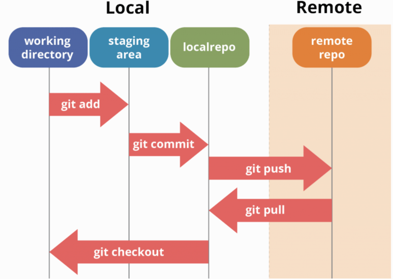

<a id="readme-top"></a>

<!-- PROJECT LOGO -->
<br />
<div align="center">
  <a href="">
    
    
  </a>

  <h3 align="center">HCMUT Grade Portal Service Server</h3>

  <p align="center">
    Dự án hướng đến mục tiêu xây dựng một trang web cung cấp dịch vụ quản lý điểm số tiện lợi nhanh chóng dành cho sinh viên và giảng viên trong nhà trường.
    <br />
    <a href="../README.md"><strong>Tổng quan dự án</strong></a>
    •
    <a href="../reports/report.md"><strong>Báo cáo tiến độ</strong></a>
    •
    <a href="./user-guide.md"><strong>Hướng dẫn sử dụng</strong></a>
    •
    <a href="../document.md"><strong> Tài liệu dự án</strong></a>
    <br />
    <br />
  </p>
</div>

---

# Mục lục

1. [Tài liệu về Git workflow của dự án](#tài-liệu-về-git-workflow-của-dự-án)
2. [Cấu trúc Branch của dự án](#cấu-trúc-branch-của-dự-án)
   - [Nhánh chính (Main Branches)](#nhánh-chính-main-branches)
   - [Nhánh phụ (Supporting Branches)](#nhánh-phụ-supporting-branches)
3. [Quy trình Gitflow](#quy-trình-gitflow)
   - [Làm việc với Feature](#làm-việc-với-feature)
   - [Làm việc với Release](#làm-việc-với-release)
   - [Làm việc với các nhánh Hotfix](#làm-việc-với-các-nhánh-hotfix)

---

# Tài liệu về Git workflow của dự án

Dưới đây là tài liệu Gitflow được áp dụng trong team trong giai đoạn hoàn thiện sản phẩm.


---

## Cấu trúc Branch của dự án

### Nhánh chính (Main Branches):

- **main**: Nhánh này chứa mã nguồn ổn định và đã được phát hành. Mỗi lần bạn phát hành một phiên bản, mã trong nhánh `main` sẽ là mã mà người dùng cuối sử dụng.
- **staging**: Nhánh này chứa mã nguồn đang được kiểm thử trước khi phát hành. Tất cả các tính năng mới sẽ được tích hợp vào nhánh `staging` trước khi được phát hành.

### Nhánh phụ (Supporting Branches):

- **Feature Branches**:
  - Được tạo ra từ nhánh `staging` để phát triển một tính năng mới. Tên nhánh thường có dạng `feature/<tên-tính-năng>`.
  - Sau khi hoàn thành, nhánh này sẽ được hợp nhất (merge) vào nhánh `staging`.
- **Release Branches**:

  - Được tạo ra từ nhánh `staging` khi bạn sẵn sàng phát hành một phiên bản mới. Tên nhánh thường có dạng `release/<phiên-bản>`.
  - Nhánh này cho phép bạn sửa lỗi và thực hiện các thay đổi nhỏ trước khi hợp nhất vào nhánh `main` và `staging`.

- **Hotfix Branches**:
  - Được tạo ra từ nhánh `main` để sửa lỗi nghiêm trọng cần phải khắc phục ngay lập tức. Tên nhánh thường có dạng `hotfix/<tên-lỗi>`.
  - Sau khi sửa lỗi, nhánh này sẽ được hợp nhất vào cả hai nhánh `main` và `staging`.

---

## Quy trình Gitflow

#### Làm việc với feature:

Để phản ánh quy trình cập nhật tính năng vào nhánh `staging` (bao gồm push code lên nhánh `feature`, tạo merge request, liên kết với issue cần đóng, và sau đó merge vào `staging`), nhóm sẽ áp dụng quy trình làm việc với `feature` theo flow chi tiết hơn như sau:


1. **Tạo nhánh `feature` từ nhánh `staging`**:

   - Trước tiên, bạn cần tạo nhánh `feature` từ nhánh `staging` để phát triển tính năng mới:

   ```bash
   git checkout -b feature/<tên-tính-năng> staging
   ```

2. **Thực hiện các thay đổi cần thiết cho tính năng**:

   - Bạn thực hiện việc phát triển tính năng trên nhánh `feature` vừa tạo. Sau khi hoàn tất, commit các thay đổi này:

   ```bash
   git add .
   git commit -m "Phát triển tính năng <tên-tính-năng>"
   ```

3. **Push nhánh `feature` lên repository từ xa**:

   - Sau khi commit xong, bạn cần push nhánh `feature` lên repository.

   ```bash
   git push origin feature/<tên-tính-năng>
   ```

4. **Tạo Merge Request (Pull Request)**:

   - Truy cập vào giao diện repository trên GitHub/GitLab.
   - Tạo một **Merge Request** (Pull Request) từ nhánh `feature/<tên-tính-năng>` vào nhánh `staging`.
   - Trong phần mô tả của Merge Request, hãy đảm bảo liên kết đến **issue** cần đóng bằng cách sử dụng từ khóa **Closes #issue_number** (nếu có). Ví dụ:
     ```
     Closes #123: Tính năng quản lý người dùng
     ```

5. **Code Review và Approval**:

   - Nhóm phát triển hoặc người có trách nhiệm sẽ thực hiện **Code Review**.
   - Nếu cần, thêm các thay đổi hoặc điều chỉnh dựa trên phản hồi từ Code Review.
   - Sau khi Merge Request được chấp nhận và thông qua (approved), bạn có thể tiến hành bước tiếp theo.

6. **Merge `feature` vào `staging`**:

   - Sau khi Merge Request được thông qua, tiến hành merge nhánh `feature` vào nhánh `staging`. Điều này thường được thực hiện qua giao diện của GitHub/GitLab khi bạn nhấn nút **Merge**.

7. **Xóa nhánh `feature` sau khi merge**:

   - Sau khi nhánh `feature` đã được merge vào `staging`, bạn có thể xóa nhánh `feature` trên repository từ xa:

   ```bash
   git push origin --delete feature/<tên-tính-năng>
   ```

   - Bạn cũng có thể xóa nhánh `feature` cục bộ (nếu cần):

   ```bash
   git branch -d feature/<tên-tính-năng>
   ```

8. **Tiếp tục quy trình phát hành và hotfix**:
   - Sau khi các tính năng mới đã được kiểm thử trong nhánh `staging`, bạn có thể tiếp tục theo quy trình tạo nhánh `release` và hợp nhất vào `main`, hoặc thực hiện các hotfix cần thiết nếu có lỗi nghiêm trọng phát sinh.

#### Làm việc với Release:

1. Khi sẵn sàng phát hành một phiên bản mới, tạo một nhánh phát hành từ nhánh `staging`:
   ```bash
   git flow release start <phiên-bản>
   ```
2. Sau khi hoàn tất phát hành (bao gồm các sửa lỗi nếu cần), bạn có thể kết thúc nhánh phát hành và hợp nhất vào cả hai nhánh `main` và `staging`:
   ```bash
   git flow release finish <phiên-bản>
   ```
3. Xuất bản nhánh release lên repository từ xa:
   ```bash
   git flow release publish <release-version>
   ```
4. Lấy nhánh release từ repository từ xa:
   ```bash
   git flow release pull origin <release-version>
   ```

#### Làm việc với các nhánh Hotfix:

1. Khi cần sửa một lỗi nghiêm trọng trên phiên bản đã phát hành, tạo một nhánh sửa lỗi từ nhánh `main`:
   ```bash
   git flow hotfix start <tên-lỗi>
   ```
2. Sau khi bạn đã sửa lỗi, kết thúc nhánh hotfix và hợp nhất vào cả nhánh `main` và `staging`:
   ```bash
   git flow hotfix finish <tên-lỗi>
   ```
3. Xuất bản nhánh hotfix lên repository từ xa:
   ```bash
   git flow hotfix publish <hotfix-name>
   ```
4. Lấy nhánh hotfix từ repository từ xa:
   ```bash
   git flow hotfix pull origin <hotfix-name>
   ```

---
