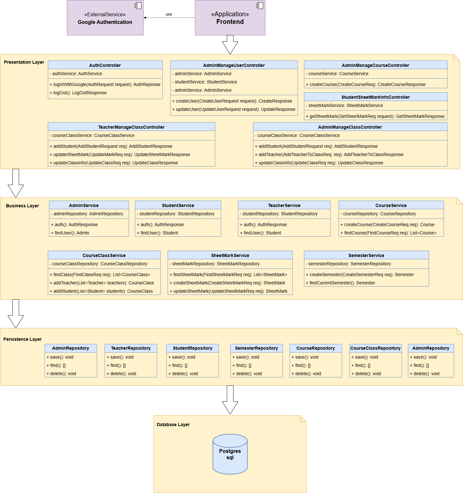
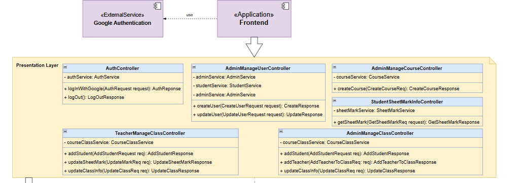
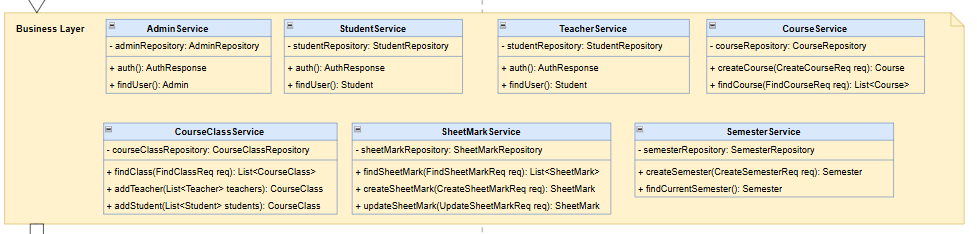
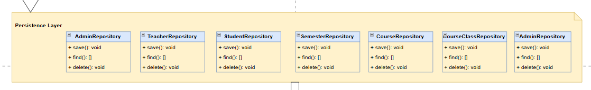
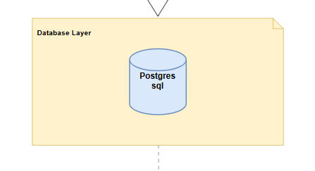

<!-- PROJECT LOGO -->
 

  

  <h3 align="center">HCMUT Grade Portal Service Server</h3>

  

    Dự án hướng đến mục tiêu xây dựng một trang web cung cấp dịch vụ quản lý điểm số tiện lợi nhanh chóng dành cho sinh viên và giảng viên trong nhà trường.
     
    <a href="../../README.md"><strong>Tổng quan dự án</strong></a>
    •
    <a href="../../reports/report.md"><strong>Báo cáo tiến độ</strong></a>
    •
    <a href="../user-guide.md"><strong>Hướng dẫn sử dụng</strong></a>
    •
    <a href="../document.md"><strong> Tài liệu dự án</strong></a>
     
     
  

---

# Mục lục

1. [Giới thiệu](#giới-thiệu)
2. [Tài liệu về Kiến trúc Hệ thống](#tài-liệu-về-kiến-trúc-hệ-thống)
   - [Kiến trúc Phân lớp (Layered Architecture)](#kiến-trúc-phân-lớp-layered-architecture)
   - [Sơ đồ hiện thực của Hệ thống](#sơ-đồ-hiện-thực-của-hệ-thống)
3. [Chi tiết về các tầng trong Kiến trúc Phân lớp](#chi-tiết-về-các-tầng-trong-kiến-trúc-phân-lớp)
   - [Tầng Presentation](#tầng-presentation)
   - [Tầng Business](#tầng-business)
   - [Tầng Persistence](#tầng-persistence)
   - [Tầng Data](#tầng-data)

---

# Giới thiệu

Dự án hướng đến mục tiêu xây dựng một trang web cung cấp dịch vụ quản lý điểm số tiện lợi nhanh chóng dành cho sinh viên và giảng viên trong nhà trường.

# Tài liệu về Kiến trúc Hệ thống

Dưới đây là tài liệu Kiến trúc Hệ thống được team sử dụng trong dự án.

## Kiến trúc Phân lớp (Layered Architecture)

Khi phát triển một hệ thống như HCMUT Grade Portal, việc xác định kiến trúc hệ thống là yếu tố vô cùng quan trọng. Kiến trúc hệ thống đóng vai trò là "bộ khung" tổng thể, giúp định hình cách các thành phần trong hệ thống tương tác với nhau và đảm bảo hệ thống vận hành hiệu quả, an toàn và dễ bảo trì. Một kiến trúc được thiết kế tốt không chỉ hỗ trợ việc phát triển ban đầu mà còn đảm bảo hệ thống có khả năng mở rộng trong tương lai, đáp ứng được các nhu cầu mới mà không gây ảnh hưởng lớn đến các phần khác của hệ thống.

Đặc biệt, với hệ thống yêu cầu độ chính xác cao khi tương tác với nhiều đối tượng thành phần như Grade Portal, việc có một kiến trúc chặt chẽ và dễ bảo trì sẽ giúp việc vận hành và mở rộng hệ thống trở nên đơn giản hơn.

Mặc dù kiến trúc Monolithic có một số hạn chế, nhưng trong trường hợp của Grade Portal, đây vẫn là lựa chọn khả thi. Các hạn chế chính của kiến trúc monolithic bao gồm:

- Khó mở rộng khi hệ thống lớn dần lên.
- Khả năng bảo trì thấp khi phải thay đổi một phần nhỏ của hệ thống, có thể ảnh hưởng đến toàn bộ ứng dụng.
- Độ phức tạp gia tăng khi tích hợp các chức năng mới.

Việc kiểm tra và triển khai một thay đổi nhỏ trong hệ thống monolithic có thể dẫn đến việc phải triển khai lại toàn bộ hệ thống, gây ra thời gian ngừng hoạt động và tăng nguy cơ lỗi.

Tuy nhiên, vẫn có lý do để chọn kiến trúc Monolithic ở giai đoạn này. Đầu tiên, kiến trúc monolithic dễ triển khai và phát triển nhanh hơn, đặc biệt trong giai đoạn khởi đầu của dự án. Với một đội ngũ nhỏ và khi chưa có nhiều yêu cầu phức tạp về khả năng mở rộng, việc tập trung vào một ứng dụng duy nhất giúp tiết kiệm thời gian phát triển, đơn giản hóa việc quản lý code và dễ dàng kiểm thử hệ thống. Hơn nữa, với quy mô của Grade Portal ở giai đoạn ban đầu, hệ thống vẫn có thể duy trì được hiệu suất tốt khi hoạt động dưới dạng một ứng dụng monolithic. Khi hệ thống lớn dần và có nhiều tính năng mới, việc chuyển đổi sang các kiến trúc phức tạp hơn (như microservices) hoàn toàn có thể được cân nhắc sau này.

Ngoài ra, để nhanh chóng nắm rõ kiến trúc cần hiện thực, nhóm chúng em quyết định xây dựng hệ thống theo kiến trúc phân lớp (**Layered Architecture**), một dạng kiến trúc monolithic, để đảm bảo tính tổ chức và dễ bảo trì trong quá trình phát triển. Kiến trúc phân lớp sẽ chia hệ thống thành nhiều tầng (**layers**) với các chức năng cụ thể, đảm bảo mỗi tầng chỉ chịu trách nhiệm cho một nhiệm vụ cụ thể và độc lập với các tầng khác.

## Sơ đồ hiện thực của Hệ thống

Trong phần này nhóm đã sử dụng Draw.io để hiện thực sơ đồ. Đường dẫn cụ thể tới sơ đồ hiện thực chi tiết của hệ thống nằm [ở đây](https://drive.google.com/file/d/1SVd3zjJVpOsC4I7qyyPzUe3PvnhHKlQ_/view?usp=drive_link).

Hệ thống được thiết kế theo kiến trúc **Layered Architecture** với luồng dữ liệu chạy theo một hướng duy nhất. Các Layer cao hơn có thể lấy dữ liệu từ các Layer thấp hơn, nhưng ngược lại, các Layer thấp hơn sẽ không được phép lấy dữ liệu từ các Layer cao hơn. Cách tổ chức này giúp đảm bảo sự tách biệt rõ ràng giữa các Layer, tăng cường khả năng bảo trì và mở rộng hệ thống. Nếu không tuân theo, hệ thống có thể gặp phải vấn đề phụ thuộc tuần hoàn (Dependency Injection).

# Chi tiết về các tầng trong Kiến trúc Phân lớp

### Tầng Presentation

Presentation Layer là tầng đầu tiên của kiến trúc, chịu trách nhiệm tiếp nhận các yêu cầu API từ Client, bao gồm các ứng dụng Mobile và Web. Nhiệm vụ của tầng này bao gồm:

- Tiếp nhận và xử lý dữ liệu đầu vào từ người dùng, kiểm tra tính đầy đủ và đúng đắn.
- Chuyển tiếp dữ liệu tới tầng Business Layer để xử lý các logic nghiệp vụ.
- Đảm bảo dữ liệu trả về cho Client là đúng đắn, tuân theo cấu trúc được mô tả trong tài liệu của hệ thống.

Tóm lại, tầng Presentation đóng vai trò quan trọng trong việc tiếp nhận yêu cầu từ Client và đảm bảo dữ liệu đầu vào và đầu ra chính xác.

### Tầng Business

Business Layer là tầng tiếp theo sau Presentation Layer, chịu trách nhiệm xử lý logic nghiệp vụ của hệ thống. Nhiệm vụ của tầng này bao gồm:

- Nhận dữ liệu đầu vào từ tầng Presentation và thực hiện các logic nghiệp vụ tương ứng.
- Gọi dữ liệu hoặc các hàm từ tầng Persistence để truy vấn hoặc cập nhật dữ liệu trong Database khi cần thiết.

Để giải quyết vấn đề bảo trì và phát triển codebase trong kiến trúc Monolithic, các logic nghiệp vụ được tổ chức thành các module tái sử dụng, ứng với từng nghiệp vụ khác nhau. Nhờ đó, việc thay đổi hay bảo trì logic nghiệp vụ không ảnh hưởng đến các API được cung cấp cho Client, vì tầng Presentation chỉ gọi các service dưới dạng hàm trừu tượng mà không cần biết logic chi tiết.

### Tầng Persistence

Persistence Layer là tầng chịu trách nhiệm tương tác với Database. Các đối tượng trung gian trong tầng này (thường là các Repository Interface) cung cấp các hàm trừu tượng giúp tự động tạo ra các câu truy vấn tới Database. Tầng này giúp:

- Tự động hóa các thao tác truy vấn và cập nhật dữ liệu.
- Dễ dàng thay đổi giữa các hệ quản trị cơ sở dữ liệu (ví dụ: từ MongoDB sang PostgreSQL) mà không ảnh hưởng nhiều đến các tầng khác.

Nhìn chung, Persistence Layer là nơi tương tác trực tiếp với nơi lưu trữ dữ liệu của hệ thống.

### Tầng Data

Data Layer là tầng thấp nhất trong kiến trúc, là nơi lưu trữ toàn bộ dữ liệu cho các logic nghiệp vụ của hệ thống. Nhiệm vụ của tầng này bao gồm:

- Quản lý và lưu trữ dữ liệu trong cơ sở dữ liệu.
- Thực hiện các thao tác đọc, ghi, và triển khai các truy vấn theo cách được định nghĩa từ Persistence Layer.

Data Layer đóng vai trò là nền tảng dữ liệu cho toàn bộ hệ thống và là nơi mà các tầng khác có thể lấy và lưu trữ dữ liệu phục vụ cho các nghiệp vụ của hệ thống.

---
